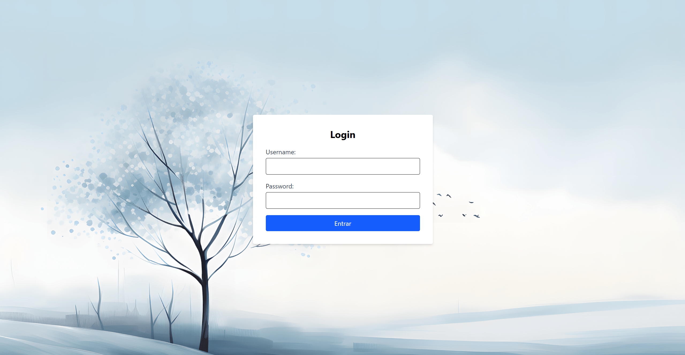
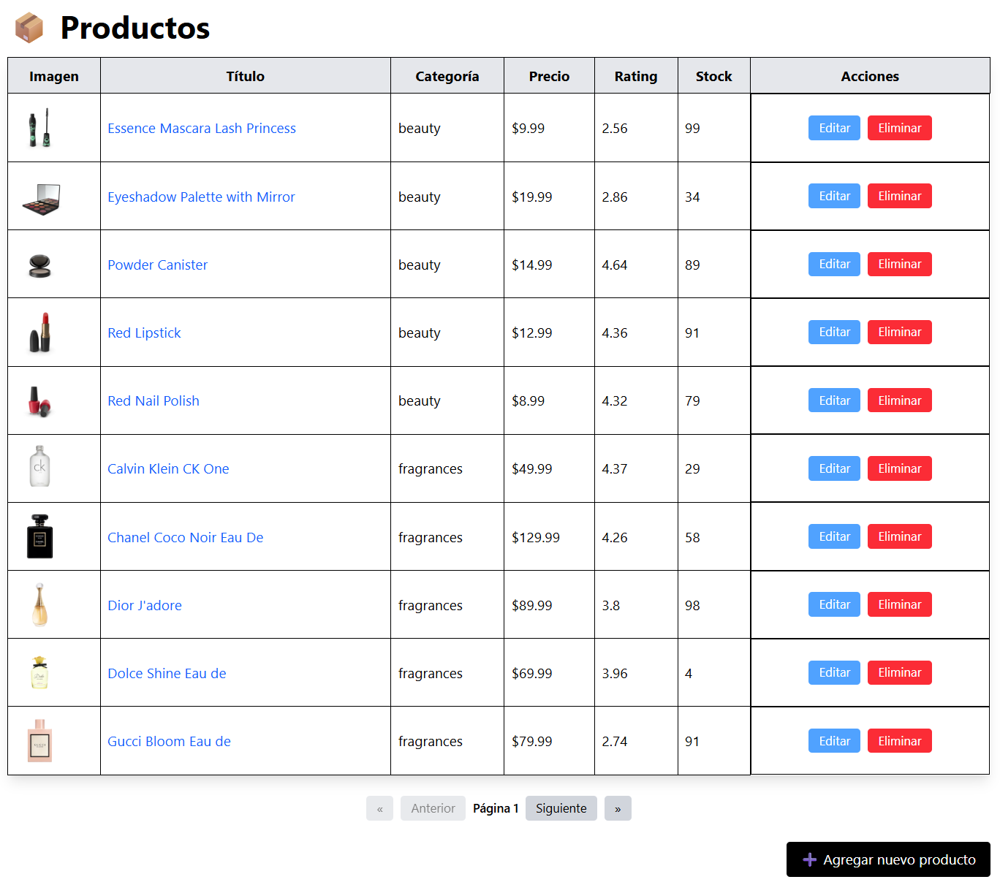
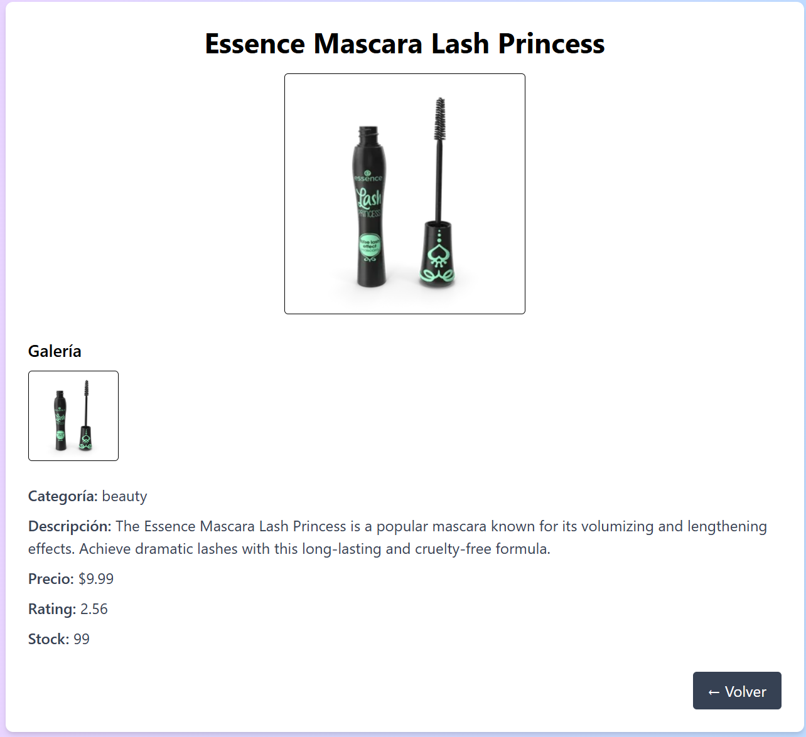
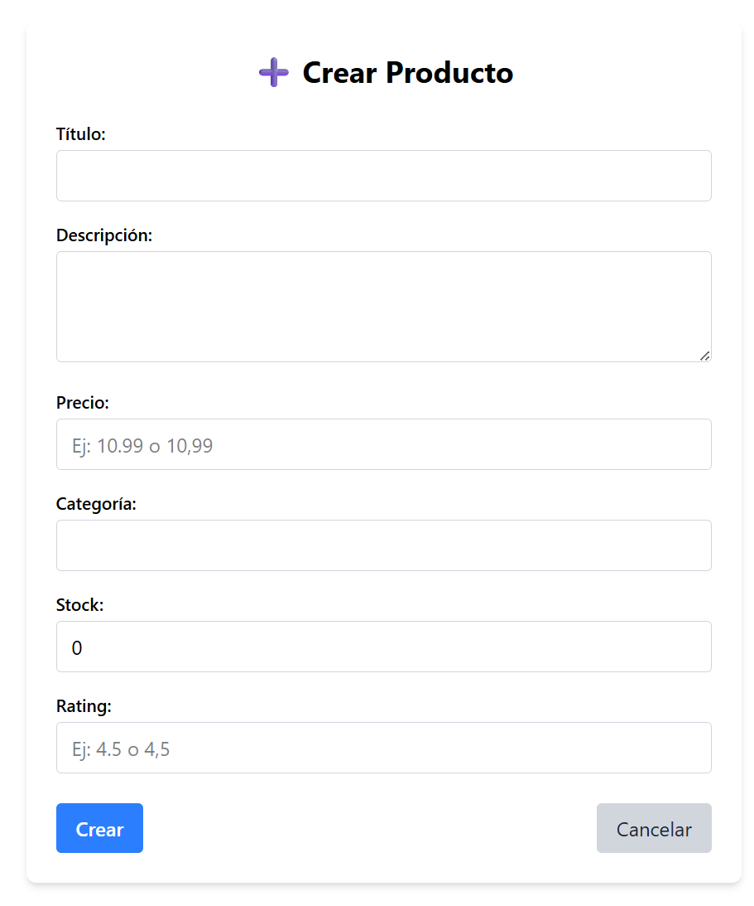
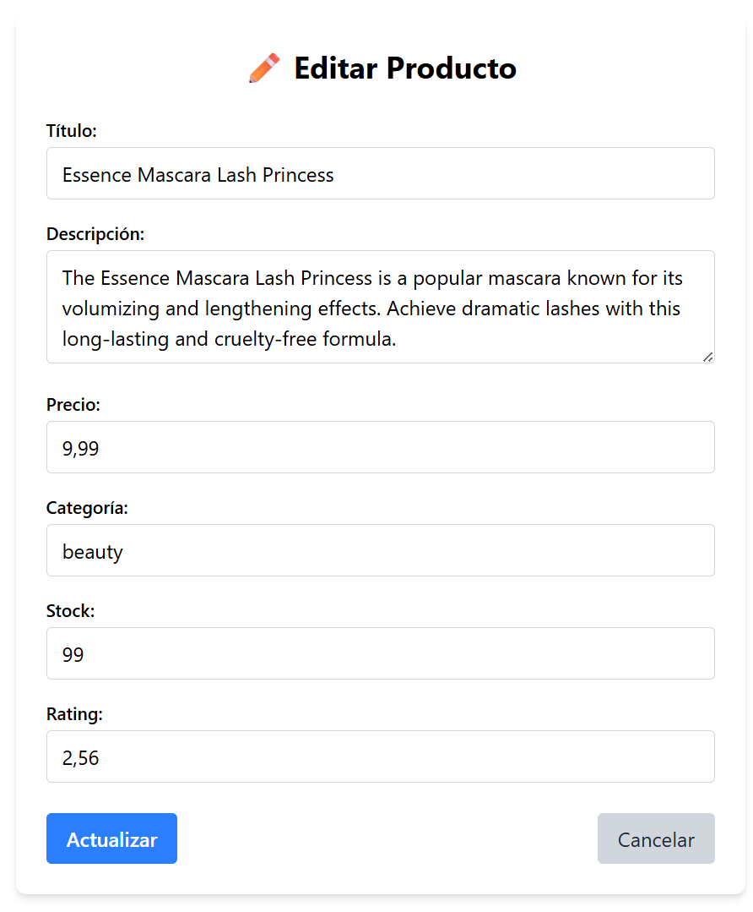

# 🛍️ Proyecto - Frontend

Este proyecto muestra un sistema de autenticación, tabla de productos, detalles del producto, crear producto, modificar producto, eliminar producto. 

## 🚀 Funcionalidades

- Listado de productos (consumo desde API)
- Crear, editar y eliminar productos
- Validación de formularios
- Estilos responsivos con Tailwind CSS

## 🛠️ Tecnologías

- [Vue 3](https://vuejs.org/)
- [Vite](https://vitejs.dev/)
- [Tailwind CSS](https://tailwindcss.com/)

## 📦 Instalación

1. Clona el repositorio:
```bash
git clone https://github.com/Paola-20-user/prueba-frontend.git
cd prueba-frontend
```

2. Instala las dependencias:
```bash
npm install
```

3. Ejecuta el servidor de desarrollo:
```bash
npm run dev
```

📸 Capturas 

**Pantalla de Login:**



**Pantalla de Tabla de Productos:**



**Pantalla de Detalle de un Producto:**



**Pantalla de Crear Producto:**



**Pantalla de Modificar Producto:**




🙋‍♀️ Autora

Paola U.
Prueba técnica de frontend 2025.
